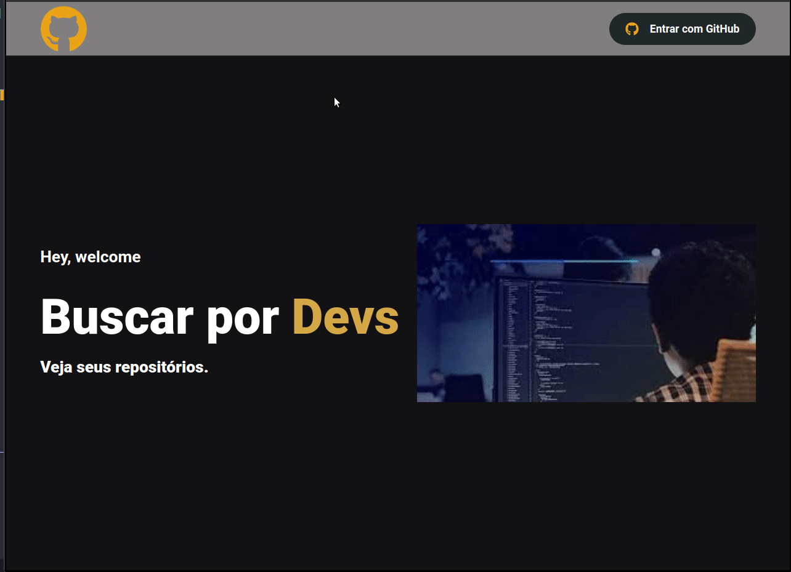

<h3 align="center">
 Nextjs
</h3>

<p align="center">
   
</p>

### :computer: How To Run

- Primeiro instale as dependencias:

```bash
yarn
```

### :computer: Scripts de inicialização:

- Inicie a aplicação em modo desenvolvimento!

```bash
yarn dev
```

- Abra [http://localhost:3000](http://localhost:3000) para vizualizar em seu navegador

### Criado um aplicativo OAuth:

- Para utilizar os Endpoints abaixo, você precisará estar autenticado, para isso - você irá utilizar a autenticação do GITHUB:

- Utilizando a api do GITHUB
- https://developer.github.com/v3/ consumindo os seguintes endpoints:

- Endpoint user: https://api.github.com/users/NOME_USUARIO
- Endpoint repos: https://api.github.com/users/NOME_USUARIO/repos
- Endpoint starred: https://api.github.com/users/NOME_USUARIO/starred

### Documentação

- Guia Autenticação: https://docs.github.com/pt/developers/apps/building-oauth-apps

- Criar um aplicativo OAuth: https://docs.github.com/pt/developers/apps/building-oauth-apps/creating-an-oauth-app

### Configuração de autenticação com GitHub

```bash
import NextAuth from "next-auth";
import Providers from "next-auth/providers";

export default NextAuth({
  // Configure one or more authentication providers
  providers: [
    Providers.GitHub({
      clientId: GITHUB_CLIENT_ID,
      clientSecret: GITHUB_CLIENT_SECRET,
      scope: "read:user,repo",
    }),

    // ...add more providers here
  ],

  // // A database is optional, but required to persist accounts in a database
  // database: process.env.DATABASE_URL,
});

```

### Modo de utilização

```bash

import { signIn, useSession, signOut } from "next-auth/client";
const [session] = useSession();

```

## 🤔 Tem alguma feature e quer contribuir?

- Faça um fork desse repositório;
- Cria uma branch com a sua feature: `git checkout -b minha-feature`;
- Faça commit das suas alterações: `git commit -m 'feat: Minha nova feature'`;
- Faça push para a sua branch: `git push origin minha-feature`.

Depois que o merge da sua pull request for feito, você pode deletar a sua branch.

---

Make with ♥ by Wesley Guerra :wave:
